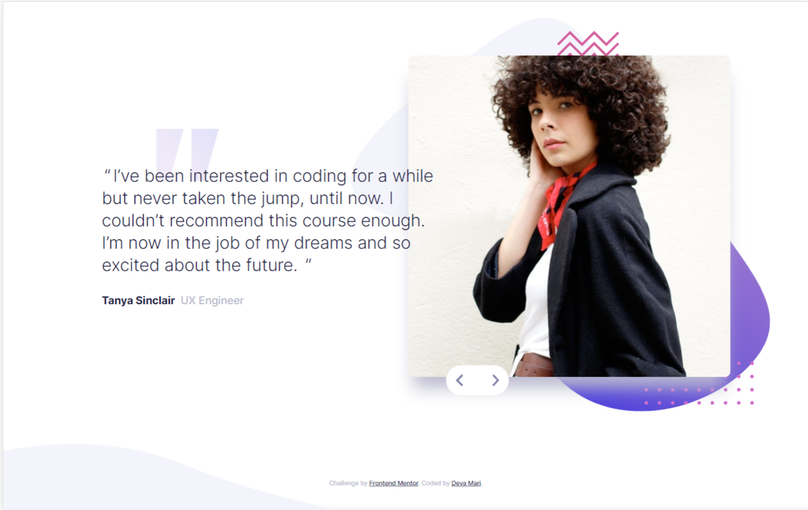

# Frontend Mentor - Coding bootcamp testimonials slider solution

This is a solution to the [Coding bootcamp testimonials slider challenge on Frontend Mentor](https://www.frontendmentor.io/challenges/coding-bootcamp-testimonials-slider-4FNyLA8JL). Frontend Mentor challenges help you improve your coding skills by building realistic projects. 

## Table of contents

- [Overview](#overview)
  - [The challenge](#the-challenge)
  - [Screenshot](#screenshot)
  - [Links](#links)
- [My process](#my-process)
  - [Built with](#built-with)
  - [What I learned](#what-i-learned)
  - [Continued development](#continued-development)
- [Author](#author)


## Overview

### The challenge

Users should be able to:

- View the optimal layout for the component depending on their device's screen size
- Navigate the slider using either their mouse/trackpad or keyboard

### Screenshot




### Links

- Solution URL: (https://github.com/Deva-Mari/testimonial-slider)
- Live Site URL: (https://musical-rugelach-67f52c.netlify.app/)

## My process

### Built with

- Semantic HTML5 markup
- Mobile-first workflow
- Sass
- [React](https://reactjs.org/) - JS library
- [Typescript](https://www.typescriptlang.org/)

### What I learned

- Practiced useState and useEffect
```js
const [image, setImage] = useState("");
  const [person, setPerson] = useState(0);
  useEffect(() => {
    import(`./assets/${data[person].img}`).then((image) =>
      setImage(image.default)
    );
  }, [data, person]);
```
- improved Layouting skills
- learned how to attach keydown Event to div
```js
  const keyPressHandler = (e: React.KeyboardEvent<HTMLDivElement>) =>{
    if(e.code === "ArrowRight"){
      nextClickHandler();
    }
    if(e.code === "ArrowLeft"){
      prevClickHandler();
    }
  }
```

### Continued development

- improve box-shadow to get closer to design

## Author

- Website - [Deva Mari](https://devamari.com/)
- Frontend Mentor - [@Deva-Mari](https://www.frontendmentor.io/profile/Deva-Mari)
- GitHub- [@Deva-Mari](https://github.com/Deva-Mari)